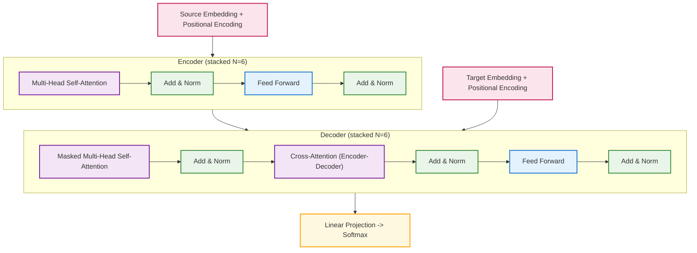

# practice_transformer
Transformer 구조를 직접 구현하고 실습하며, 그 동작 원리를 이해하는 것을 목표로 하는 학습용 프로젝트입니다.
- [Notion: Transformer Study Log](https://www.notion.so/Transformer-2262d05d9c4680de8371fc72ee3c87dd?source=copy_link)
- 본 프로젝트는 `Attention Is All You Need` 논문을 기반으로 하여, 
Transformer 모델의 핵심 구조(`Embedding`, `Multi-Head Attention`, `Position-wise FFN`, `Encoder/Decoder` 스택 등)를 
직접 코드로 옮기고 실험하는 데 초점을 두고 있습니다.
> 참고: Vaswani, A. et al. (2017). [Attention Is All You Need](https://arxiv.org/abs/1706.03762), NeurIPS 2017.

---

## 구현 초점
- `Encoder / Decoder 모듈` (`Multi-Head Attention`, `Feed-Forward Network(FFN)`, `ADD&LayerNorm`)
- `Positional Encoding` (sinusoidal)
- `Causal Mask` (look-ahead mask for autoregressive decoding)
- `Padding Mask`

## 코드 구조

### Source
- 번역하려는 문장의 입력
- [단어 ID] -> [Token Embedding + Positional Encoding]
- Encoder에 들어가서 문장 전체의 의미를 압축한 표현(context vector)을 생성

### Encoder
- 입력 문장 전체를 동시에 처리(Self-Attention)
- 단어 간 관계를 반영하여 풍부한 표현을 학습
- 최종적으로 `[batch, src_len, d_model]` 형태의 시퀀스 표현을 출력

### Target
- 번역하려는 목표 언어 문장의 입력
- 훈련 시: 정답 문장을 한 토큰씩 밀어 넣음
- 추론 시: 이미 생성된 단어들을 다시 입력으로 사용해 다음 단어를 예측

### Decoder
- `Masked Multi-Head Self-Attention`: 미래 단어를 보지 않도록 causal mask 적용
- `Cross-Attention`: Encoder의 context vector를 참조해 Source–Target 매핑 학습
- `FFN + Add&Norm`: 각 단계별 표현 정제
- 최종 출력: `[batch, tgt_len, d_model] -> Linear layer -> [batch, tgt_len, vocab_size]`

---
## 