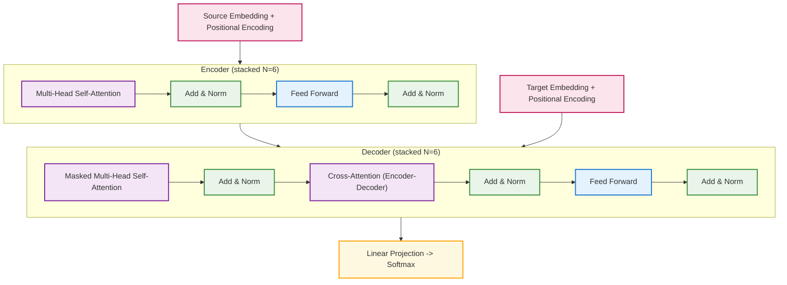

# practice_transformer
Transformer 구조를 직접 구현하고 실습하며, 그 동작 원리를 이해하는 것을 목표로 하는 학습용 프로젝트입니다.

본 프로젝트는 `Attention Is All You Need` 논문을 기반으로 하여,
Transformer 모델의 핵심 구조(`Embedding`, `Multi-Head Attention`, `Position-wise FFN`, `Encoder/Decoder` 스택 등)를
직접 코드로 옮기고 실험하는 데 초점을 두고 있습니다.
> 참고: Vaswani, A. et al. (2017). [Attention Is All You Need](https://arxiv.org/abs/1706.03762), NeurIPS 2017.

---

## 구현 초점
- Encoder / Decoder 모듈 (Multi-Head Attention, Feed-Forward Network, Residual + LayerNorm)
- Positional Encoding (sinusoidal)
- Causal Mask (look-ahead mask for autoregressive decoding)
- Padding Mask
- Auto-regressive `generate` 함수 (추론용)

## 코드 구조

---